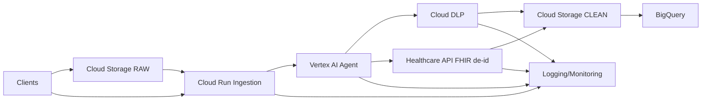

# Schéma d’architecture – MedicAnonym (UE)

## Notes de lecture

* **Cloud Run API Ingestion** reçoit les événements d’upload et normalise les jobs.
* **Vertex AI Agent (Gemini)** sélectionne la voie de traitement (DLP ou FHIR de-id), propose/valide les templates DLP, puis orchestre l’exécution.
* **Cloud DLP** gère la dé-identification (masking, tokenisation, FPE) pour texte/CSV/PDF (après OCR si nécessaire).
* **Cloud Healthcare API** applique la dé-id native sur les ressources **FHIR**.
* **Sécurité** : périmètre **VPC Service Controls**, chiffrage **CMEK (Cloud KMS)**, secrets dans **Secret Manager**, IAM minimal.
* **Observabilité** : journaux + métriques dans **Cloud Logging/Monitoring**, alertes sur erreurs/latence/taux de résidu PHI.

## Flux (résumé)

1. Upload → Bucket **RAW** → Event → **Ingestion (Run)**.
2. **Agent Vertex AI** lit la consigne, choisit **DLP** ou **FHIR de-id**, et lance le traitement (directement ou via **Pub/Sub** + **Worker**).
3. Sortie → Bucket **CLEAN** (fichiers) et/ou **BigQuery** (analytics). Journaux centralisés.

## Variantes

* **Temps réel API** : appeler l’ingestion directement via HTTP (Cloud Run), utile pour faibles volumes.
* **Revue humaine** : ajouter **Workflows + AppSheet/Cloud Run UI** pour escalade des cas ambigus.
* **Edge/latence** : partitionner par région UE (europe-west1/west9) selon proximité et services disponibles.
